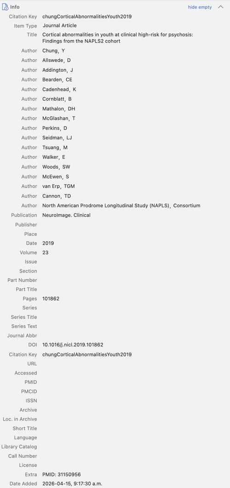
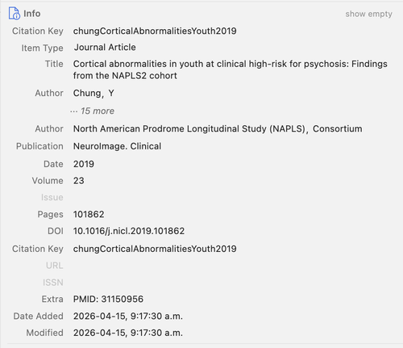

# Condense Info View

A [Zotero](https://www.zotero.org/) plugin that hides empty fields in the Info panel, so you can focus on what's actually there.


## What it does

The Zotero Info panel shows every possible field for an item type — often 20–30 rows — even when most are blank. This plugin condenses that view into three tiers:

| Tier | Behaviour |
|------|-----------|
| **Filled fields** | Always shown normally |
| **Important empty fields** | Shown dimmed (~35% opacity) as a prompt to fill them in — which fields count as "important" depends on the item type (e.g. DOI and Volume for journal articles, ISBN and Publisher for books) |
| **Unimportant empty fields** | Hidden entirely |

Authors are collapsed to **first and last** when there are three or more, with a clickable **··· N more** in between.

A **show empty** toggle in the Info section header reveals everything at once.

### Before / after

<table>
<tr>
<th>Before</th>
<th>After</th>
</tr>
<tr>
<td></td>
<td></td>
</tr>
</table>

## Installation

1. Download the latest `condense-info-view.xpi` from the [Releases](../../releases) page.
2. In Zotero: **Tools → Add-ons → gear icon → Install Add-on From File…**
3. Select the downloaded `.xpi` file and restart when prompted.

Requires **Zotero 7.0 or later** (including Zotero 8).

## Usage

- **Normal view:** empty unimportant fields are hidden; empty important fields are dimmed.
- **show empty button** (in the Info section header, next to the collapse arrow): reveals all empty fields temporarily. Click **hide empty** to return to condensed view.
- **Author collapsing:** items with 3+ authors show only the first and last. Click **··· N more** to expand. Selecting a new item re-collapses automatically.

## Important fields by item type

The fields kept visible (dimmed) when empty:

| Item type | Important empty fields shown |
|-----------|------------------------------|
| Journal Article | Publication, Date, Volume, Issue, Pages, DOI, ISSN, URL |
| Book | Publisher, Place, Date, ISBN, Edition, URL |
| Book Section | Book Title, Publisher, Place, Date, Pages, ISBN, URL |
| Thesis | University, Place, Date, Thesis Type, URL |
| Conference Paper | Conference Name, Proceedings Title, Date, Pages, Place, DOI, URL |
| Report | Institution, Place, Date, Report Number, Report Type, URL |
| Webpage | URL, Website Title, Access Date, Date |
| … | (see `condense-info-view.js` for the full list) |

## Development

```bash
git clone https://github.com/ppavlidis/condense-info-view
cd condense-info-view

# Build the XPI
bash build-xpi.sh

# Install in Zotero: Tools → Add-ons → gear → Install Add-on From File…
```

To iterate without reinstalling, use Zotero's extension proxy file:

```bash
echo "$(pwd)" > ~/Library/Application\ Support/Zotero/Profiles/<profile>/extensions/condense-info-view@example.com
# Then remove extensions.lastAppVersion from prefs.js and restart Zotero
```

## Compatibility

- Zotero 7.x and 8.x
- macOS, Windows, Linux

## License

MIT
